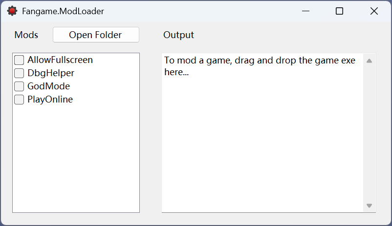

本文将从零开始制作一个更换Kid皮肤的Mod：CrimsonKid

## 准备

Visual Studio 2022

.NET 9 SDK

## 项目结构

- **Fangame.ModLoader**：加载器核心代码
- **Fangame.ModLoader.Gui**：加载器的WinForms用户界面
- **WorkingDirectory**：Fangame.ModLoader.Gui的工作路径，里面包含编译好的二进制Mods文件以及Running文件夹，便于调试和Mod发布
- **Mods**：示例Mod项目
- **UndertaleModTool**：Fangame.ModLoader的依赖项

## 快速开始

要制作mod，首先需要完整克隆存储库：

```sh
git clone --recursive https://github.com/cubeww/Fangame.ModLoader.git
```

然后使用Visual Studio打开**Fangame.ModLoader.sln**，首先按下**Ctrl+Shift+B**构建解决方案， 再按下**F5**，应该就能看见程序正常启动了。



### 创建新Mod

为了简化Mod开发过程，我们在Mods文件夹中提供了**TEMPLATE**项目。请直接复制一份，并将文件夹重命名为**CrimsonKid**，同时将文件夹中的文件重命名：

- **CrimsonKid**.csproj

- **CrimsonKid**Mod.cs

- files.txt 文件第一行：**CrimsonKid**.dll

  

  

修改完毕之后，请在Visual Studio中添加CrimsonKid.csproj项目到解决方案的Mods文件夹。然后先**Ctrl+Shift+B**构建解决方案，再**F5**运行Fangame.ModLoader.Gui，你应该能看见你的Mod被正常显示到了左侧的Mod列表中。


> 请注意，每次F5调试mod之前请务必先执行**Ctrl+Shift+B**，这样才能确保触发Mod项目的**构建后事件**，以将必要的文件复制到WorkingDirectory/Mods文件夹中。

下面来正式编写Mod代码文件。打开CrimsonKidMod.cs并编辑：

```c#
using Fangame.ModLoader;

namespace CrimsonKid;

public class CrimsonKidMod : Mod
{
    public override void Load()
    {
        if (CommonData != null)
        {
            // Mod data...
        }
    }
}
```

所有Mod对象都必须继承**Fangame.ModLoader.Mod**类。继承后，我们需要重写Load()方法，Mod加载器将会在解析游戏数据之后调用这个方法。

**CommonData**代表解析后游戏数据，我们需要先判断它是否为空，因为游戏数据解析可能会失败（不受支持的游戏，例如YYC）

接下来，我们要将游戏中的**sprPlayerIdle**精灵替换成我们自己的图片。只需使用foreach遍历CommonData.Sprites，然后判断名称即可。

```c#
using Fangame.ModLoader;

namespace CrimsonKid;

public class CrimsonKidMod : Mod
{
    public override void Load()
    {
        if (CommonData != null)
        {
            foreach (var sprite in CommonData.Sprites)
            {
                if (sprite.Name == "sprPlayerIdle")
                {
                    sprite.ReplaceImages(Path.Combine(ModDirectory, "sprPlayerIdle.png"), 4);
                }
            }
        }
    }
}

```

当获取到名为"sprPlayerIdle"的精灵时，只需调用ReplaceImages方法，将精灵的所有图片替换为ModDirectory/sprPlayerIdle.png文件。

这里的**ModDirectory**属性指的是**WorkingDirectory/Mods/CrimsonKid/**，我们应该在构建Mod项目之后手动将这个sprPlayerIdle.png文件复制进去。为了简化这个步骤，我们在模板项目配置了一个复制脚本，它可以在每次构建之后会自动将files.txt中列出的文件复制到ModDirectory中去。因此，你需要做的是：

- 在files.txt中加入需要复制的文件名称

- 把需要复制的文件放入项目目录（与CrimsonKid.csproj同级）中

  

  

  

接下来先Ctrl+Shift+B构建解决方案，再F5运行，尝试运行一个游戏，应该就能看见Mod被正常应用了。


当然现在只有“sprPlayerIdle”这一个精灵的图片被替换。我们只要仿照它把其它几个精灵也给一起替换即可。

```c#
if (sprite.Name == "sprPlayerIdle")
{
    sprite.ReplaceImages(Path.Combine(ModDirectory, "sprPlayerIdle.png"), 4);
}
if (sprite.Name == "sprPlayerRunning")
{
    sprite.ReplaceImages(Path.Combine(ModDirectory, "sprPlayerRunning.png"), 4);
}
if (sprite.Name == "sprPlayerJump")
{
    sprite.ReplaceImages(Path.Combine(ModDirectory, "sprPlayerJump.png"), 2);
}
if (sprite.Name == "sprPlayerFall")
{
    sprite.ReplaceImages(Path.Combine(ModDirectory, "sprPlayerFall.png"), 2);
}
if (sprite.Name == "sprPlayerSliding")
{
    sprite.ReplaceImages(Path.Combine(ModDirectory, "sprPlayerSliding.png"), 2);
}
if (sprite.Name == "sprBow")
{
    sprite.ReplaceImages(Path.Combine(ModDirectory, "sprBow.png"), 4);
    sprite.OriginX = 22;
    sprite.OriginY = 23;
}
```

files.txt:

```
CrimsonKid.dll
sprPlayerIdle.png
sprPlayerRunning.png
sprPlayerJump.png
sprPlayerFall.png
sprPlayerSliding.png
sprBow.png
```

这样我们就能看到kid的几张精灵都被正常替换。


但是还有两个小瑕疵，一是sprBow应该位于kid的后面而不是前面，而是sprBow的动画播放速度非常快，这都不是我们想要的。

如果你熟悉GameMaker，这些应该都比较容易实现：

- 将bow对象的深度设为比player更高的深度
- 在bow对象的创建事件中设置image_speed

编写为Mod代码如下：

```c#
CommonObject? bow = null;
CommonObject? player = null;

foreach (var obj in CommonData.Objects)
{
    if (obj.Name == "player")
        player = obj;
    if (obj.Name == "bow")
        bow = obj;
}

if (bow != null)
{
    if (player != null)
        bow.Depth = player.Depth + 1;
    bow.EventAddCode(EventType.Create, 0, "\nimage_speed = 0.2;"); // \n is important!
}
```

现在构建并运行游戏，即可看到图片被正常显示：


当然，这个Mod应该只适用于少部分游戏，因为很多游戏的kid对象名叫objPlayer而不是player（比如YoYoYo引擎）。这就需要加入一些额外的判断逻辑：

```c#
foreach (var obj in CommonData.Objects)
{
    if (obj.Name == "player" || obj.Name == "objPlayer")
        player = obj;
    if (obj.Name == "bow" || obj.Name == "objBow")
        bow = obj;
}
```

现在运行一个YoYoYo引擎的游戏应该也能够正常加载：


这样一个简单的Kid皮肤Mod就大功告成了。现在你可以将**Repo/WorkingDirectory/Mods/CrimsonKid**文件夹打包分享给其他人了。该文件夹中应该包含这些文件：


## 配置文件

你可以为Mod添加一个“配置文件”，以允许让用户调整一些Mod的参数。比如说我们要加入一个“bow精灵播放速率”的参数，你需要编写一个CrimsonKidConfig类（名字随意），并继承自**ModConfig**：

```c#
using System.ComponentModel;
using Fangame.ModLoader;

namespace CrimsonKid;

public class CrimsonKidConfig : ModConfig
{
    [Category("Sprite")]
    [Description("Image speed of the 'bow' sprite.")]
    public double BowImageSpeed { get; set; } = 0.2;
}

```

为了能让程序识别，请务必将字段暴露为属性（推荐使用自动属性 { get; set; } ）。同时推荐添加**Category**以及**Description**特性以让用户界面支持显示这些信息提示（更多特性请参考[PropertyGrid](https://learn.microsoft.com/en-us/dotnet/api/system.windows.forms.propertygrid)）。

要使用配置类，直接在Mod代码中调用GetConfig<TConfig>()即可。加载器会自动处理，并在文件不存在时自动帮你创建配置。

```c#
public class CrimsonKidMod : Mod
{
    public override void Load()
    {
        var config = GetConfig<CrimsonKidConfig>();
        ...
        bow.EventAddCode(EventType.Create, 0, $"\nimage_speed = {config.BowImageSpeed};");
        ...
    }
}
```

再次调试运行，你应该能看见配置属性被显示到Config区域中。


## 高级

**CommonData**是ModLoader对GM8Data和UndertaleData的一个包装器，可以同时支持GM8和GMS两种游戏数据，在编写Mod时应尽可能使用这个类型以简化代码。

但CommonData提供的功能有限，在需要对游戏数据进行更全面的控制时，可以使用**GM8Data**和**UndertaleData**属性对底层游戏资源进行控制。

```c#
public override void Load()
{
    if (CommonData != null)
    {
        // GM8 or GMS...
    }

    if (GM8Data != null)
    {
        // GM8 Specific...
    }

    if (UndertaleData != null)
    {
        // GMS Specific...
    }
}
```

除了ModDirectory之外，Mod基类还有一些重要属性可以访问。它们大多取决于游戏的可执行文件类型，请参阅：

[ModProperties](./ModProperties.html)
