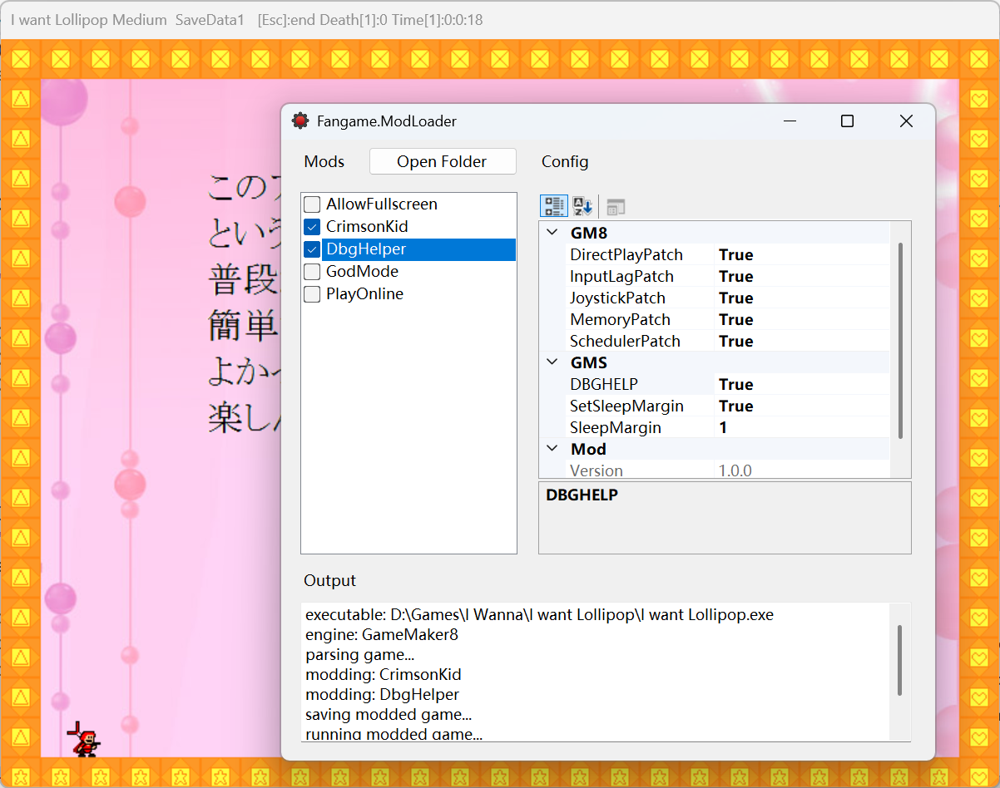

# Fangame.ModLoader

Fangame.ModLoader is a tool written in C# that enables **mod-loading** functionality for I wanna fangames developed with GameMaker, such as PlayOnline, DbgHelper, Skinning, and more.



## Why?

Traditional modding methods typically require manually decompiling game files, modifying them using software like GameMaker, and then repacking them into a new executable. This process is time-consuming and labor-intensive, and must be repeated every time the game receives an update.

This tool provides a universal solution to the above workflow by automating the modification and repacking of game files into executables, while also allowing users to enable/disable specific mods as needed.

Additionally, the tool places modded games into a separate folder during each run, avoiding pollution of the original game folder. There is also no need to distribute large modded game files—only the mods themselves require distribution.

## Supported Games

The Mod Loader utilizes the GM8 game file parsing library and the UndertaleModLib parsing library, supporting most GameMaker 8 and GameMaker Studio (non-YYC) games. For other games, the Mod Loader will not parse game data but allows custom mod logic to be written for additional processing of the final binary file.

## Usage

1. Download the Mod Loader from the **Releases** page and extract it. You will see the following structure:

```
Fangame.ModLoader/  
	Mods/  
	Running/  
	Fangame.ModLoader.Gui.exe  
	...  
```

- **Fangame.ModLoader.Gui.exe** is the **loader itself**.
- The **Mods** folder stores all **available mods**.
- The **Running** folder holds **modded games** (users do not need to access this, as the loader runs them automatically and cleans the folder upon each launch).

1. To mod a game, run **Fangame.ModLoader.Gui.exe**.
2. Check the mod names you wish to enable in the left listbox.
3. Drag the game executable (.exe) into the output text box. The Mod Loader will automatically begin modding and launch the game.

## Mod Development

Mod development requires knowledge of GameMaker and C# programming. Refer to [Develop](./Develop(CN).md) Documentation.

## Credits

- [OpenGMK](https://github.com/OpenGMK/OpenGMK) : GM8 game data parsing method.
- [UndertaleModTool](https://github.com/UnderminersTeam/UndertaleModTool): GMS game data parsing library.